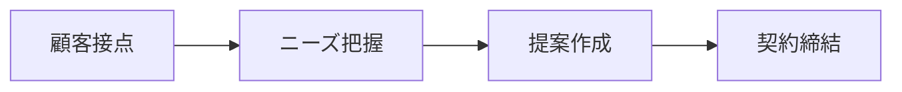
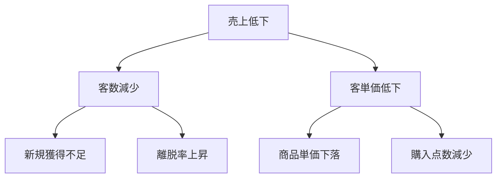

# Marp業務用スライド作成ガイドライン

## 1. 基本原則

### 1.1 ピラミッド原則
- **結論ファースト**: 各スライドの冒頭に主要メッセージを配置
- **MECE（Mutually Exclusive, Collectively Exhaustive）**: 重複なく、漏れなく
- **So What?テスト**: 各スライドが「だから何？」に答えられるか確認

### 1.2 ワンスライド・ワンメッセージ
```markdown
---
# 売上改善の3つの施策
1. 既存顧客の単価向上
2. 新規顧客の獲得
3. リピート率の改善
---
```

## 2. スライド構成テンプレート

### 2.1 全体構成（ストーリーライン）
```markdown
---
marp: true
theme: default
paginate: true
---

# タイトルスライド
## プロジェクト名
### 日付・発表者

---
# エグゼクティブサマリー
- 課題
- 提案
- 期待効果

---
# アジェンダ
1. 現状分析
2. 課題の特定
3. 解決策の提案
4. 実行計画
5. 期待効果

---
# 各セクション
（詳細コンテンツ）

---
# まとめ・ネクストステップ
```

### 2.2 セクション構成パターン

#### A. 問題解決型
```markdown
---
# 1. 現状（As-Is）
- ファクト1
- ファクト2
- ファクト3

---
# 2. 課題
- 根本原因の分析
- 影響範囲の特定

---
# 3. 解決策（To-Be）
- 施策A → 効果X
- 施策B → 効果Y
- 施策C → 効果Z
```

#### B. 比較分析型
```markdown
---
# オプション比較
| 項目 | オプションA | オプションB | オプションC |
|------|------------|------------|------------|
| コスト | ◎ | ○ | △ |
| 効果 | ○ | ◎ | ○ |
| 実現性 | △ | ○ | ◎ |
| **推奨** | | **✓** | |
```

## 3. ビジュアル要素の活用

### 3.1 図表の使い分け
```markdown
---
# 売上推移（時系列データ→折れ線グラフ）


**ポイント**: 2023年Q3から回復傾向

---
# 市場シェア（構成比→円グラフ）


- 当社: 35%（業界2位）
- 競合A: 42%
- その他: 23%

---
# プロセスフロー（手順→フローチャート）

```

### 3.2 強調表現
```markdown
---
# 重要ポイントの強調

**太字**で重要性を示す

> 引用形式で権威性を演出

- ✅ 完了項目
- ⚠️ 注意事項
- 🎯 目標値

<div style="background-color: #f0f0f0; padding: 20px; border-radius: 10px;">
重要メッセージをボックスで囲む
</div>
```

## 4. ロジックの可視化テクニック

### 4.1 因果関係の明示
```markdown
---
# 売上低下の要因分析


```

### 4.2 マトリクス分析
```markdown
---
# 施策の優先順位付け

<div style="position: relative; width: 600px; height: 400px; margin: auto;">
  <div style="position: absolute; top: 0; left: 300px; width: 1px; height: 400px; background: #ccc;"></div>
  <div style="position: absolute; top: 200px; left: 0; width: 600px; height: 1px; background: #ccc;"></div>
  <div style="position: absolute; top: 10px; left: 280px;">高</div>
  <div style="position: absolute; top: 380px; left: 280px;">低</div>
  <div style="position: absolute; top: 190px; left: 10px;">低</div>
  <div style="position: absolute; top: 190px; left: 560px;">高</div>
  <div style="position: absolute; top: 50px; left: 450px; background: #ff9999; padding: 10px; border-radius: 5px;">施策A</div>
  <div style="position: absolute; top: 100px; left: 400px; background: #99ff99; padding: 10px; border-radius: 5px;">施策B</div>
</div>

**縦軸**: インパクト / **横軸**: 実現可能性
```

## 5. データの見せ方

### 5.1 数値の表現ルール
```markdown
---
# 売上実績

## 月次売上: **1,234万円** <span style="color: green;">▲15%</span>

### 内訳
- 既存顧客: 980万円（79.4%）
- 新規顧客: 254万円（20.6%）

**前年同期比**: +15.3%
**計画比**: +8.2%
```

### 5.2 Before/After表現
```markdown
---
# 改善効果

<div style="display: flex; justify-content: space-around;">
<div style="text-align: center;">
<h3>Before</h3>
<div style="background-color: #ffcccc; padding: 20px; border-radius: 10px;">
処理時間: 48時間<br>
エラー率: 15%<br>
顧客満足度: 65%
</div>
</div>
<div style="text-align: center;">
<h3>After</h3>
<div style="background-color: #ccffcc; padding: 20px; border-radius: 10px;">
処理時間: 12時間 ⬇️<br>
エラー率: 3% ⬇️<br>
顧客満足度: 92% ⬆️
</div>
</div>
</div>
```

## 6. スライドデザインのベストプラクティス

### 6.1 レイアウト原則
- **余白を活用**: 情報を詰め込みすぎない
- **視線の流れ**: 左上→右下（Z型）を意識
- **グリッド配置**: 要素を整列させる

### 6.2 カラーパレット
```markdown
---
marp: true
theme: default
style: |
  :root {
    --primary-color: #003366;    /* メインカラー */
    --secondary-color: #0066cc;  /* アクセント */
    --success-color: #28a745;    /* ポジティブ */
    --warning-color: #ffc107;    /* 注意 */
    --danger-color: #dc3545;     /* ネガティブ */
  }
---
```

### 6.3 フォント階層
```markdown
# 大見出し（24-28pt）
## 中見出し（18-20pt）
### 小見出し（14-16pt）
本文（12-14pt）
```

## 7. プレゼンテーション設定

### 7.1 Marp基本設定
```yaml
---
marp: true
theme: default
paginate: true
header: 'プロジェクト名'
footer: '© 2024 Company Name'
backgroundImage: 'linear-gradient(to bottom, #ffffff, #f0f0f0)'
---
```

### 7.2 カスタムテーマ
```css
/* theme: custom */
section {
  font-family: 'Noto Sans JP', sans-serif;
  background-color: #ffffff;
}

h1 {
  color: var(--primary-color);
  border-bottom: 3px solid var(--secondary-color);
  padding-bottom: 10px;
}

table {
  border-collapse: collapse;
  margin: auto;
}

th {
  background-color: var(--primary-color);
  color: white;
  padding: 10px;
}
```

## 8. チェックリスト

### スライド作成前
- [ ] 聴衆の分析（役職、知識レベル、関心事）
- [ ] 目的の明確化（情報共有/意思決定/承認）
- [ ] キーメッセージの定義（3つ以内）

### スライド作成中
- [ ] 各スライドにタイトルがあるか
- [ ] ワンスライド・ワンメッセージか
- [ ] データの出典が明記されているか
- [ ] 図表に説明が付いているか

### スライド作成後
- [ ] 全体のストーリーが論理的か
- [ ] 結論が明確か
- [ ] アクションアイテムが具体的か
- [ ] 誤字脱字がないか

## 9. よくある失敗パターンと対策

### 9.1 情報過多
**問題**: 1スライドに10個以上の要素
**対策**: 分割or要約

### 9.2 論理の飛躍
**問題**: A→Cと結論づける（Bが抜けている）
**対策**: 中間ステップを明示

### 9.3 ビジュアルの不統一
**問題**: 各スライドでデザインがバラバラ
**対策**: テンプレート化

## 10. タイトルのルール
- **必ず1行に収まるように短くつける**
  - 全角30文字以内
  - 主語と述語を明確に
  - 結論を先に持ってくる

### 良い例
- ✅ 「売上は3年連続で成長、特にEC部門が牽引」
- ✅ 「コスト削減により営業利益率が5%改善」
- ✅ 「新システム導入で処理時間を75%短縮」

### 悪い例
- ❌ 「売上について」（曖昧）
- ❌ 「2021年から2024年にかけての売上推移とその要因分析および今後の展望」（長すぎる）
- ❌ 「データ」（具体性なし）

## 11. 高度なテクニック

### 11.1 ストーリーテリング
```markdown
---
# 顧客の声から始める

> 「注文してから届くまで1週間かかった」
> 「問い合わせへの返答が遅い」

→ **配送プロセスの見直しが急務**
```

### 11.2 アニメーション効果（PDF出力時は静的）
```markdown
<!-- _class: lead -->
# 段階的な情報開示

1. 現状把握 <!-- .element: class="fragment" -->
2. 課題分析 <!-- .element: class="fragment" -->
3. 解決策提案 <!-- .element: class="fragment" -->
```

### 11.3 インタラクティブ要素
```markdown
---
# 詳細はAppendixへ

<a href="#appendix-1" style="background-color: var(--primary-color); color: white; padding: 10px 20px; text-decoration: none; border-radius: 5px;">詳細データを見る</a>
```

## 12. 実践的なスライド例

### 12.1 経営層向けサマリー
```markdown
---
# 2024年度売上目標達成への道筋

## **結論**: 3つの施策で売上120億円達成可能

1. **EC強化**: デジタルマーケティング投資 → +20億円
2. **新商品投入**: 若年層向け商品開発 → +15億円
3. **営業効率化**: SFA導入による生産性向上 → +10億円

**必要投資額**: 5億円 / **ROI**: 900%
```

### 12.2 詳細分析スライド
```markdown
---
# EC売上が前年比150%成長した3つの要因

## 1. UI/UX改善（寄与度: 40%）
- 購入完了率: 2.3% → 3.5%
- 平均滞在時間: 3分 → 5分

## 2. パーソナライゼーション導入（寄与度: 35%）
- レコメンド経由売上: 全体の25%
- リピート率: 15% → 23%

## 3. モバイル最適化（寄与度: 25%）
- モバイル売上比率: 45% → 67%
- ページ読み込み速度: 3秒 → 0.8秒
```

